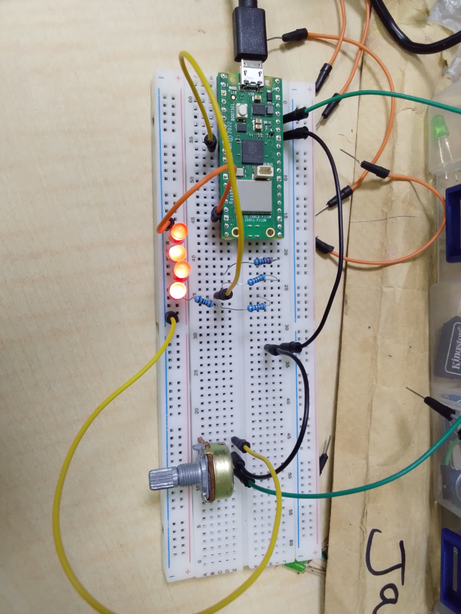

# LED-Brightness-Control-using-Potentiometer-and-Raspberry-Pi-Pico-W
This project demonstrates analog input reading and PWM brightness control using a potentiometer and LED.

## Project Overview
A potentiometer is used to vary the brightness of an LED connected to the Raspberry Pi Pico W.

The Pico W reads analog voltage values from the potentiometer and adjusts LED brightness using PWM (Pulse Width Modulation).

## Components Used
- Raspberry Pi Pico W
- LED
- 220Ω resistor
- Potentiometer
- Breadboard
- Jumper wires

## GPIO Connections
- Potentiometer output → GPIO 28 (ADC2)
- LED → GPIO 6

## Learning Outcome
- Analog signal reading
- ADC (Analog-to-Digital Conversion)
- PWM control
- Real-time hardware interaction
- Brightness modulation

  ## Project images
  

  ## Project Code
  [Click here for the project code](code/controlling_led_brigthness_using_the_potentiometer.py)

  ## Project demostration video
  [Click here for the Project demo video](https://youtu.be/CUOx_lwu0FQ)
